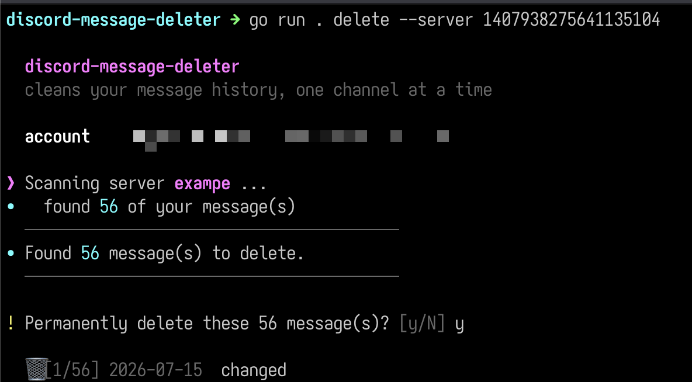

# discord-message-deleter

**A small, colorful CLI for cleaning up your own Discord message history.**

Delete across every server and DM, or narrow it down by server, channel,
message, and content — with a confirmation prompt before anything is removed.



---

## Install

```sh
go install github.com/iluvx/discord-message-deleter@latest
```

Or build from source:

```sh
git clone https://github.com/iluvx/discord-message-deleter
cd discord-message-deleter
go build -o dmd .
```

## Quick start

```sh
# 1. Store your token (prompted, so it stays out of shell history)
discord-message-deleter config set-token

# 2. Delete — you'll be asked to confirm first
discord-message-deleter delete --all
```

## Usage

### `config`

Your token is stored in your OS's standard config directory, `0600`.

| Command | Description |
| --- | --- |
| `config set-token [token]` | Store your token (prompts if omitted). |
| `config show [--reveal]` | Show config; token masked unless `--reveal`. |
| `config path` | Print the config file path. |

### `delete`

```sh
discord-message-deleter delete [flags]
```

**Targets**

| Flag | Description |
| --- | --- |
| `--all` | Every server you're in, plus every open DM. |
| `-s, --server <id>` | A specific server (repeatable). |
| `-c, --channel <id>` | A specific channel or DM (repeatable). |

**Filters** — combine freely; all must match.

| Flag | Description |
| --- | --- |
| `--contains <text>` | Only messages containing this text. |
| `--before <date>` | Only messages before a date (`YYYY-MM-DD` or RFC3339). |
| `--after <date>` | Only messages after a date. |
| `-i, --ignore <id>` | Skip an ID — server, channel, or message (repeatable). |

**Safety**

| Flag | Description |
| --- | --- |
| `-y, --yes` | Skip the confirmation prompt. |

### Examples

```sh
# Everything, everywhere
discord-message-deleter delete --all

# Everything except two servers
discord-message-deleter delete --all --ignore 123456789 --ignore 987654321

# One server, only your typos
discord-message-deleter delete --server 123456789 --contains "typo"

# One channel, only old messages, no prompt
discord-message-deleter delete --channel 987654321 --before 2024-01-01 --yes
```

## Token resolution

The token is taken from the first source that has one:

```
--token flag  →  $DISCORD_TOKEN  →  config file
```

## Notes

- Deleting is permanent. You're asked to confirm before anything is removed (skip with `--yes`).
- The tool paces itself and backs off on Discord's rate limits, so large
  clears take a while — that's expected.
- Automating actions on a user account is against Discord's Terms of Service.
  This only ever touches your own messages, but the account risk is yours.
